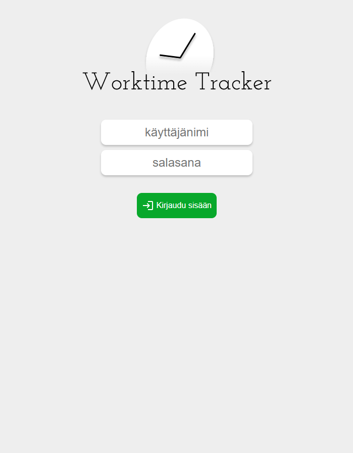
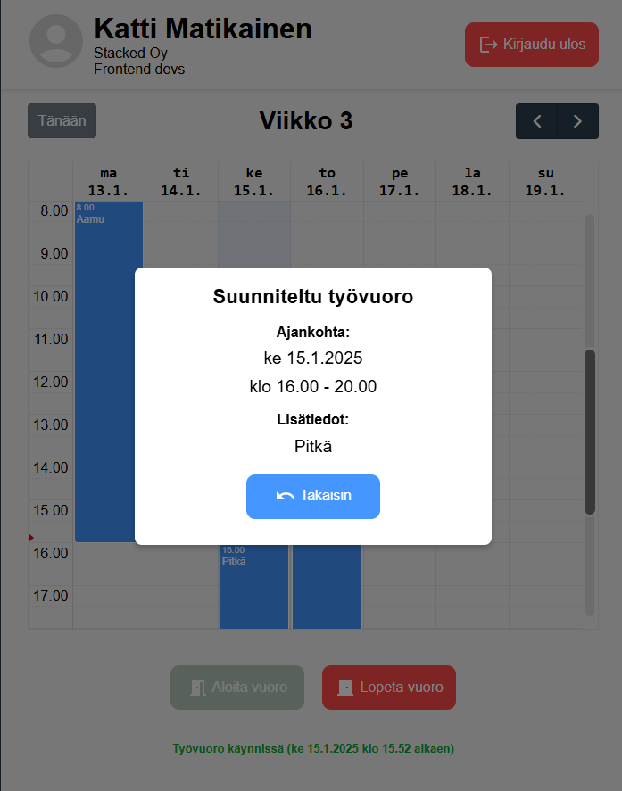
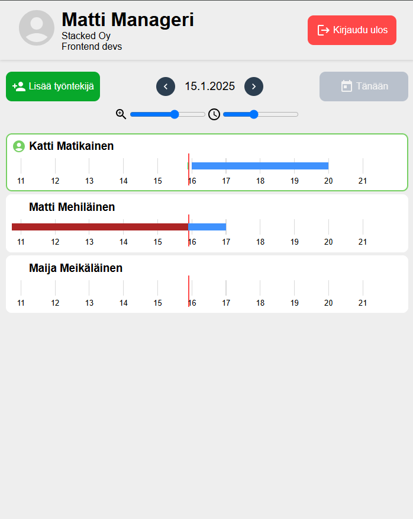
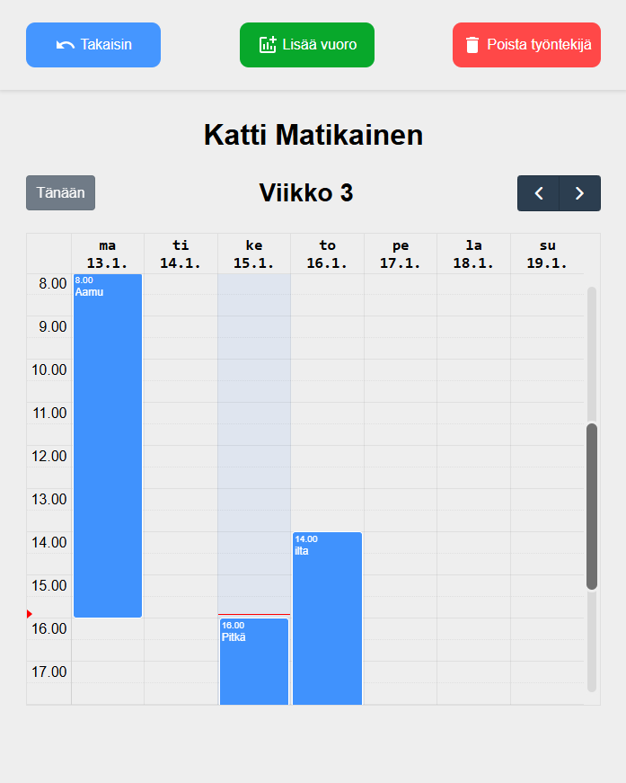

# Worktime Tracker Frontend
React + TypeScript pohjainen web-sovellus.

Projektissa käytetään [Styled components](https://styled-components.com/docs) ja [Material UI](https://mui.com/material-ui/getting-started/) tyylikirjastoja.

Etusivu:
<br>


Kun kirjautuneen käyttäjän rooli on työntekijä, sovellus navigoi sivulle, jossa käyttäjä voi tarkastella omia työvuorojaan. Kalenterissa olevaa vuoroa painamalla työvuoron yksityiskohdat saadaan tarkempaan tarkasteluun:
<br>


Kun kirjautuneen käyttäjän rooli on esimies, sovellus navigoi sivulle, jossa käyttäjä voi tarkastella alaistensa värikoodein indikoituja suunniteltuja, toteutuneita ja toteutumattomia työvuoroja. Näkymässä esimies voi myös lisätä työntekijän tai siirtyä yksittäisen työntekijän viikkonäkymämuotoiseen työvuorojen tarkasteluun:
<br>


Esimiehen näkymä alaisensa työvuorojen tarkasteluun viikkonäkymässä. Esimies voi muokata olemassa olevaa vuoroa klikkaamalla sitä, lisätä uuden vuoron tai poistaa työntekijän:
<br>


## Projektin lataaminen ja riippuvuuksien asentaminen
Asenna [Node.js](https://nodejs.org/en), jos sinulla ei sitä vielä ole.

1. Avaa komentoterminaali, navigoi kansioon, johon haluat kloonata projektin, ja kloona projekti ajamalla seuraava komento:
```
git clone https://github.com/Anttiom1/WTT-frontend.git
```
2. Siirry kloonattuun projektikansioon ajamalla komentoterminaalissa seuraava cd-komento. (Jos nimesit projektin muulla nimellä, kirjoita nimi WTT-frontend-nimen tilalle.)
```
cd WTT-frontend
```
3. Aja sen jälkeen komentoterminaalissa seuraava riippuvuudet asentava komento:
```
npm install
```
4. Avaa projekti [Visual Studio Code](https://code.visualstudio.com/) -editorilla ajamalla komentoterminaalissa seuraava komento:
```
code .
```
5. Luo kopio .env_examplesta kopio ja nimeä se .env. Vaihda BASE_URL:n portti tarvittaessa.
- Jos et käytä dockeria vaan uvicornia, uncomment VITE_WS_BASE_URL. Vaihda portti tarvittaessa.

6. Käynnistä kehitysympäristö ajamalla seuraava komento:
```
npm run dev
```
7. Siirry sen jälkeen osoitteeseen http://localhost:5173/, jossa sovellus on nyt käynnissä.

## Rahti

Frontend on buildattu myös Rahti-palveluun, ja sovellus löytyy osoitteesta **https://worktime-tracker-stacked-wtt.2.rahtiapp.fi/login**.